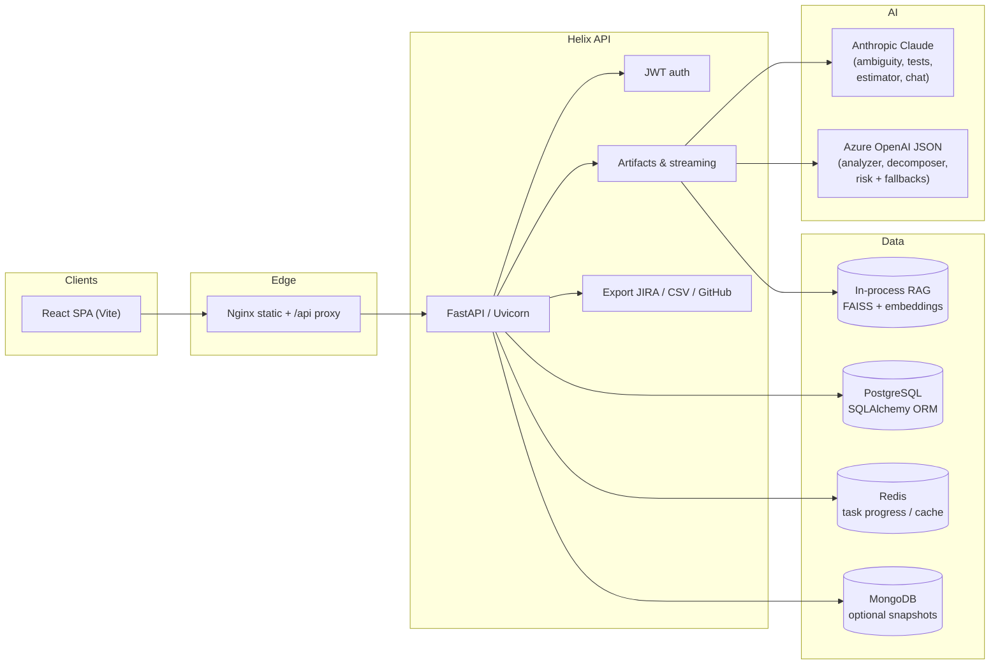

# Helix — System architecture

Helix is an **Intelligent SDLC Copilot**: it ingests raw requirements, runs multi-stage AI generation, stores a **traceable graph** of stories, tasks, tests, ambiguities, and risks, and exports to JIRA / CSV / GitHub.

## System diagram

Container deployment matches `docker-compose.yml`: **frontend** (Nginx + built SPA) → **backend** (Uvicorn) → **PostgreSQL**, **Redis**, and **MongoDB** with health checks and ordered startup.

## Data flows

1. **Auth** — User registers or logs in; API returns a JWT. Protected routes use `Authorization: Bearer`.
2. **Project lifecycle** — User creates a project with raw requirement text; clauses are split for traceability (`source_clause_ids` on every artifact).
3. **Generation** — The multi-agent pipeline runs via `run_pipeline` (SSE on `/api/artifacts/stream/{id}`). **Azure OpenAI** (JSON) runs Analyzer, Decomposer, and Risk. **Anthropic Claude** runs Ambiguity, Test Architect, and Estimator when `ANTHROPIC_API_KEY` is set; otherwise those stages use the same Azure JSON path (or mock in demo mode). Optional **Celery + Redis** runs long jobs in the background; otherwise FastAPI `BackgroundTasks` runs the same pipeline. Progress payloads include `elapsed_ms` per completed stage; the project stores `last_pipeline_timings_ms` after a successful run.
4. **Persistence** — The canonical graph lives in PostgreSQL as JSON (`pipeline_json`) plus normalized tables for requirements, artifacts, and tests for querying and export.
5. **RAG** — Requirement chunks are embedded with **sentence-transformers** (`all-MiniLM-L6-v2`) and indexed per project in **FAISS** for clause-grounded retrieval and chat citations.
6. **Export** — The same `Project` graph is rendered to JIRA REST, CSV, or GitHub Issues depending on configuration. Query `approved_only=true` to export only items marked `approved_for_export` (human gate).

## AI design decisions

### Prompt engineering rationale

- **Structured outputs** — Generation prompts ask for JSON-shaped artifacts (stories, tasks, tests, ambiguities) so downstream UI and export stay deterministic.
- **Clause grounding** — Prompts require `source_clause_ids` so every item traces back to ingestion clauses; this reduces hallucinated scope and powers ambiguity detection.
- **Streaming UX** — SSE streams pipeline stages (and optional Anthropic token streaming on dedicated routes). Progress events may include `elapsed_ms` per stage for demo and tuning.
- **Dual providers** — Azure OpenAI for strict JSON stages; Anthropic for agents that benefit from Claude when configured; mock path when keys are absent.
- **Separation of concerns** — Azure and Anthropic keys are independent so teams can align with procurement (Azure-only, Claude-only, or both).

### RAG design

- **Per-project indexes** — Embeddings are scoped by `project_id` so retrieval never crosses projects.
- **Chunk source** — Text comes from split clauses or raw requirement text, aligned with the same IDs used in generation.
- **In-process FAISS** — Keeps hackathon deployment simple (no separate vector DB); suitable for demo scale with Docker.

### Effort estimation approach

- Tasks carry **estimate_hours**, **story points**, and **confidence** fields populated during generation.
- **ProductivityMetrics** (e.g. manual vs Helix minutes, `coverage_score`, **`citation_item_rate`**) summarizes savings and traceability quality for analytics and presentation narrative.

## Component map

| Area | Role |
|------|------|
| `helix-backend/app/main.py` | FastAPI app, CORS, router wiring |
| `helix-backend/app/services/ai_service.py` | Anthropic streaming & artifact JSON |
| `helix-backend/app/services/rag_service.py` | Embeddings + FAISS search |
| `helix-backend/app/services/project_bridge.py` | ORM ↔ Pydantic `Project` sync |
| `helix-backend/app/api/routes/artifacts.py` | Generation, SSE, estimates, approval PATCH, citation bundle fields |
| `helix-backend/app/agents/orchestrator.py` | Multi-agent phases, productivity + **citation_item_rate**, **last_pipeline_timings_ms** |
| `helix-backend/app/services/export_filter.py` | Approved-only slice for governed export |
| `helix-backend/app/services/sensitive_scan.py` | Ingest-time PII/secret-shaped hints |
| `helix-backend/app/api/routes/export.py` | JIRA / CSV / GitHub |
| `frontend` | Vite React UI, Kanban, ambiguity view, export hub |
| `helix-backend/Dockerfile` | Python 3.11 image, installs deps, seeds on start |
| `frontend/Dockerfile` | Node 20 build + Nginx production serve (Compose default UI image) |
| `helix-frontend/Dockerfile` | Same stack — optional alternate build context for the mirrored UI tree |

## Seed data

`helix-backend/scripts/seed.py` (run automatically via backend entrypoint) ensures **demo@demo.com** / **demo123** and a demo project **proj_demo_seed01** with pre-generated stories, tasks, tests, ambiguities, and metrics so judges can explore without waiting on LLM latency.
