# Phase 2 — UI Verification Report

**Project:** Helix (AI-Thon)  
**Date:** 2026-05-21  
**Pages verified:** Mission Control, Workspace, Delivery Package, Judge Demo, Settings  
**Viewports:** Mobile 390×844, Tablet 768×1024, Desktop 1440×900  
**Method:** Playwright visual audit + full-page screenshots + CSS/code review  
**Screenshots:** [`helix-frontend/docs/phase2-screenshots/`](../helix-frontend/docs/phase2-screenshots/)

---

## Executive summary

| Page | Mobile | Tablet | Desktop | Overall |
|------|--------|--------|---------|---------|
| Mission Control | ⚠️ | ✅ | ✅ | **Good** — one layout fix needed |
| Workspace | ✅ | ✅ | ✅ | **Good** — empty state only without project |
| Delivery Package | ✅ | ✅ | ✅ | **Good** — empty state until pipeline runs |
| Judge Demo | ✅ | ✅ | ✅ | **Excellent** — judge-ready |
| Settings | ⚠️ | ✅ | ✅ | **Good** — minor theme/token drift |

**Overall:** Dark futuristic / glassmorphism is **consistent** on all five surfaces. **No hydration issues** (CSR). **No page-level horizontal scroll** detected at `document` level, but **Mission Control** can expose **off-viewport controls** on narrow screens (fix recommended). **Mobile** relies on a **64px icon rail** (no drawer/hamburger) — acceptable for hackathon demo but not ideal for production touch targets.

---

## Screenshots index

| Page | Mobile | Tablet | Desktop |
|------|--------|--------|---------|
| Mission Control | 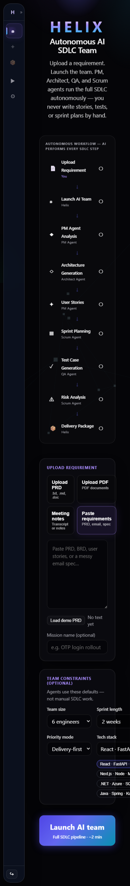 | 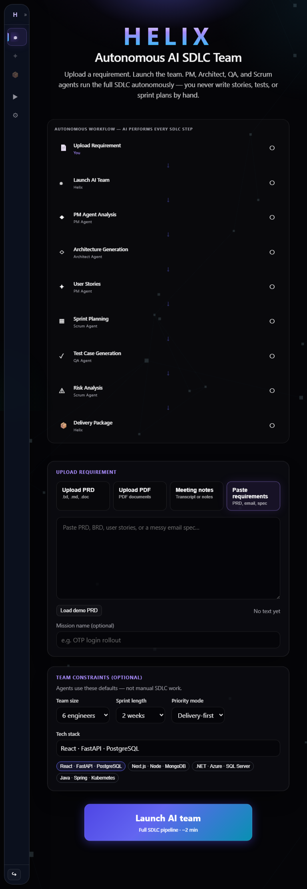 | 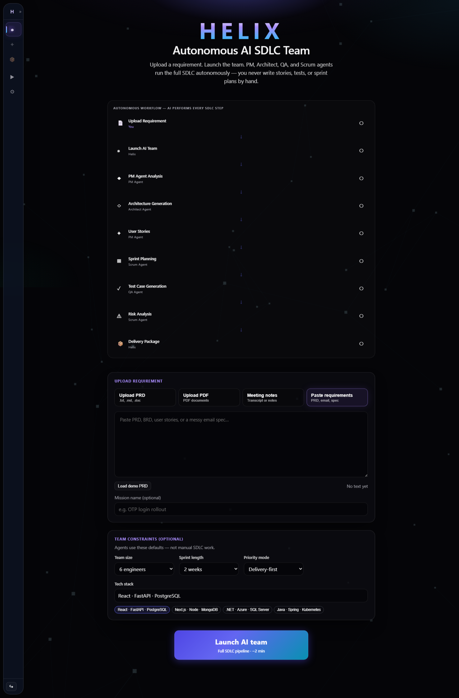 |
| Workspace | 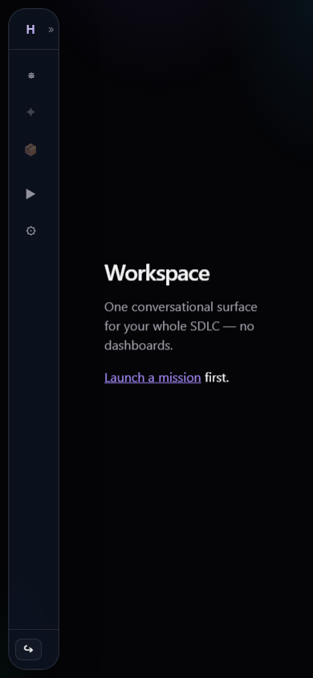 | 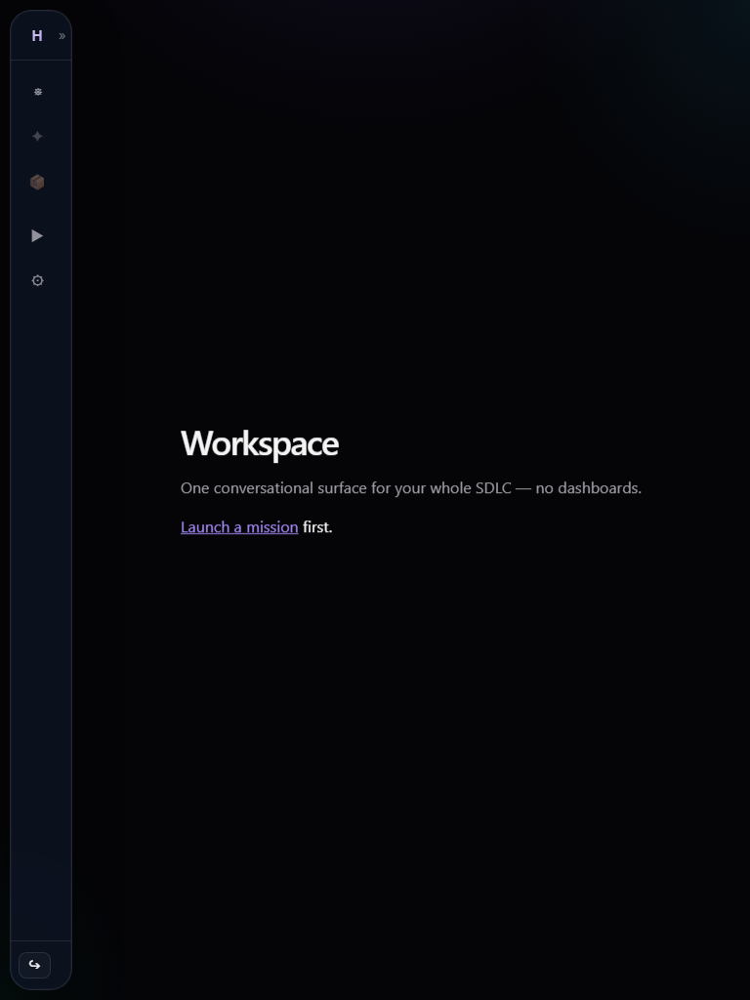 | 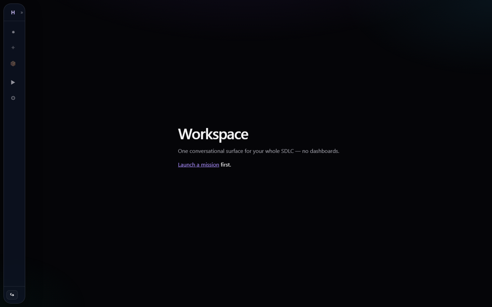 |
| Delivery Package | 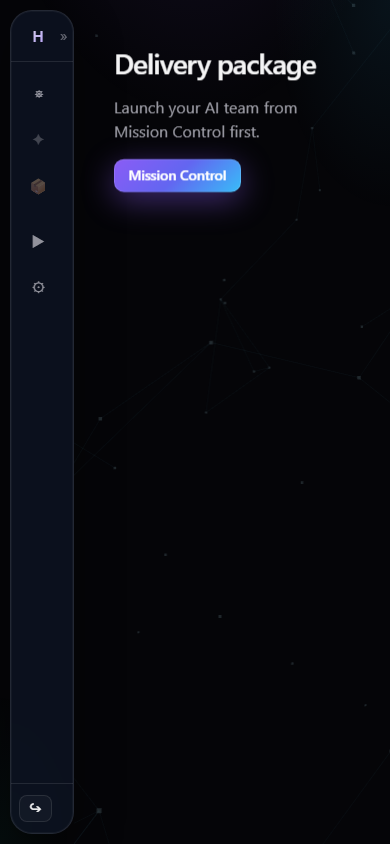 | 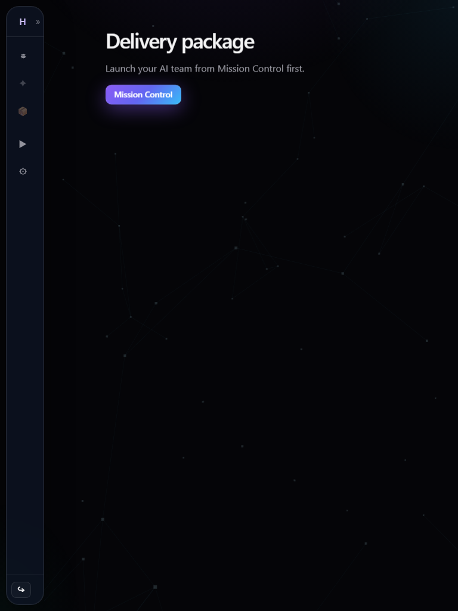 | 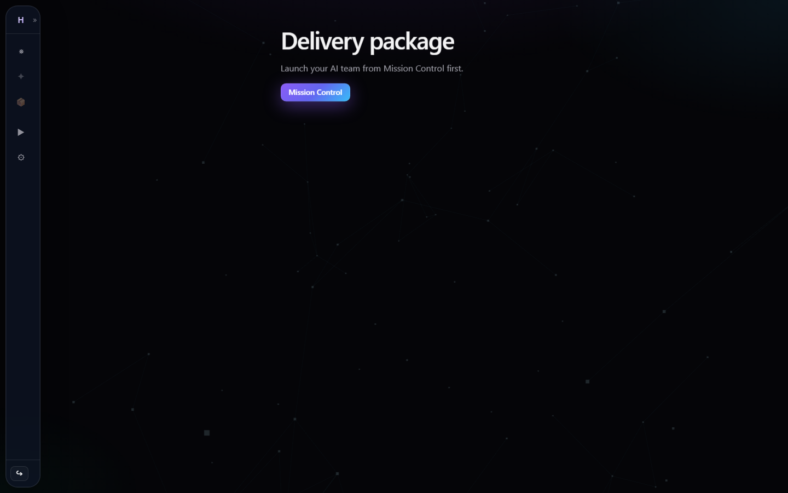 |
| Judge Demo | 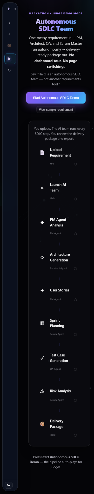 | 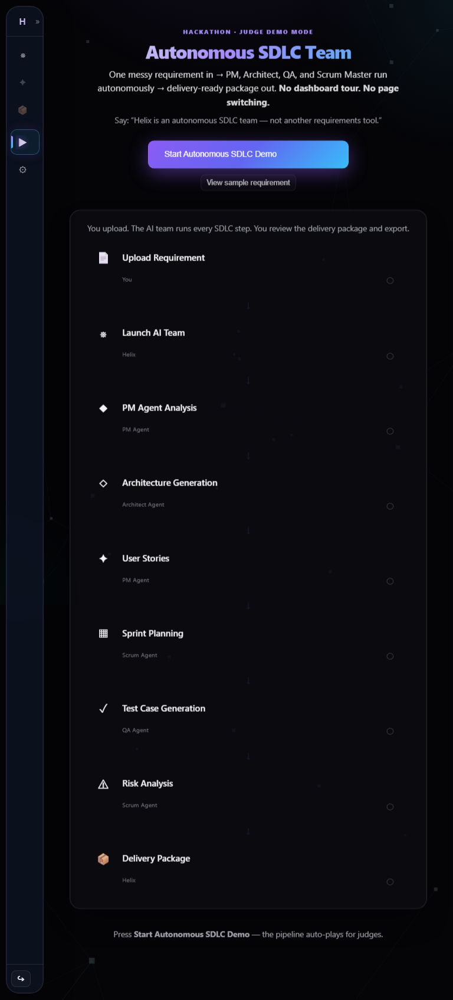 | 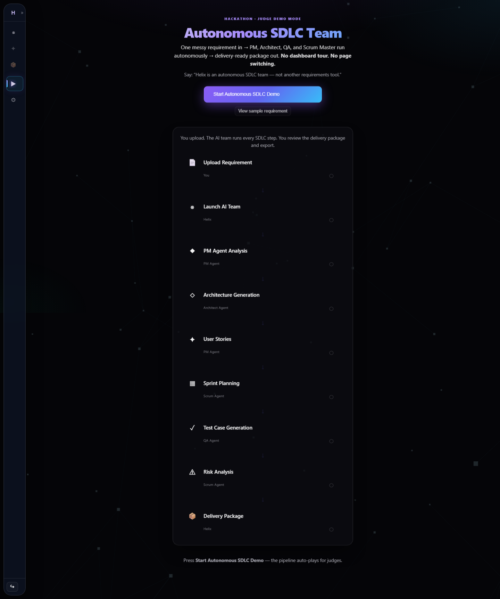 |
| Settings | 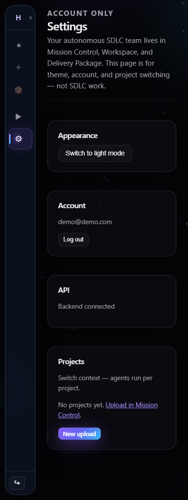 | 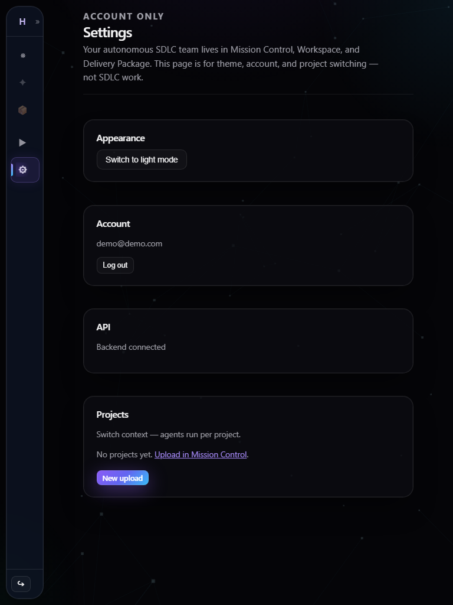 | 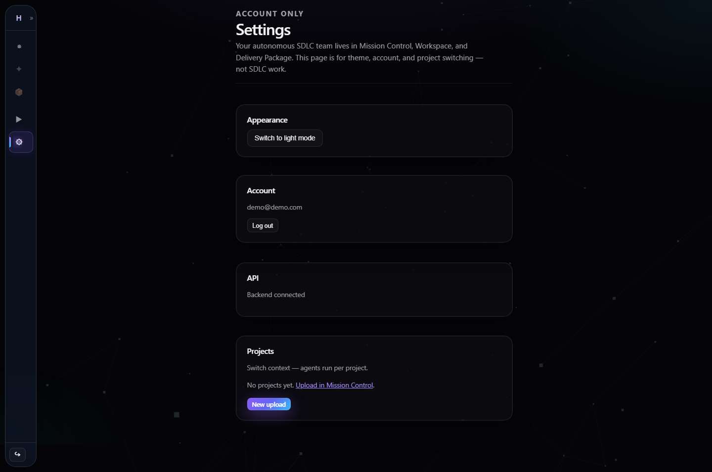 |

---

## Cross-cutting findings

### Responsive layouts — PASS (with notes)

- All five pages render without crash at 390 / 768 / 1440 widths.
- Content uses `clamp()` headings, `minmax(0, 1fr)` grids, and stacked layouts below ~800px where defined (`mc-exec-grid`, `jd-stage`).
- **Sidebar** stays a **64px collapsed rail** at all breakpoints (GSAP width animation). Main content uses remaining width; no overlay drawer on mobile.

### Mobile support — PASS (⚠️ Mission Control)

| Check | Status |
|-------|--------|
| Readable typography | ✅ |
| Touch targets (nav icons) | ⚠️ Small (~40px); no labels when collapsed |
| Horizontal overflow (document) | ✅ No `scrollWidth > clientWidth` |
| Control overflow (elements) | ❌ Mission Control tech/input row extends past 390px viewport |
| Empty states (no project) | ✅ Workspace + Delivery Package show clear CTAs |

### Tablet support — PASS

- Mission Control: single-column flow, pipeline and cards readable (see tablet screenshot).
- Judge Demo: pipeline card full width until 900px two-column finale.

### Desktop support — PASS

- Max content widths: Delivery Package `920px`, Judge Demo up to `1100px`, Settings `560px` / `1100px` via `st-page`.
- Generous whitespace; glass panels and gradients render correctly.

### Overflow issues — PARTIAL FAIL

| Issue | Severity | Location |
|-------|----------|----------|
| Tech stack chips / config row extend past mobile viewport edge | **High** | `MissionControl` → `.mc-stack-chips` / `.mc-config-grid` |
| `.app-main { overflow-x: auto }` masks overflow with scroll instead of reflow | **Medium** | `index.css` |
| Long Delivery Package scroll (9 sections) | **Low** | Expected; sticky hero may cover content on very small screens |

**Evidence (automated):** Elements with `right` > 390px on mobile Mission Control: `INPUT`, multiple `.mc-stack-chip` buttons (445–465px).

### Broken alignment — PASS (minor)

- Sidebar + main flex layout aligned; no overlapping shells.
- Team flow bar hides long step names below 640px (`.team-flow-name { display: none }`) — intentional.
- Workspace empty state vertically centered — correct.

### Missing padding — WARN

| Finding | Detail |
|---------|--------|
| Main content `padding-left: 0` on mobile | `.app-main--workspace` and `.app-main--delivery-package` zero out horizontal padding; combined with 64px sidebar, text starts **flush** to the content gutter. |
| Delivery Package | `.dp-package` adds `1.25rem` side padding — compensates partially. |
| Mission Control / Settings | Rely on `.app-main` padding (`1rem 1.5rem` in `helix-design`, overridden in places). |

**Recommendation:** Add `padding-inline: max(1rem, env(safe-area-inset-left))` on `.app-main-content` for native shell paths below 640px.

### Font inconsistencies — PASS (minor)

- **Primary:** Inter via `helix-design.css` (`--font`).
- **Settings / panels:** Reuse global `h1`, `.page-head`, `.st-eyebrow` — consistent weight/scale.
- **Monospace:** Used only in execution blocks / code-like UI (`mc-exec-blocks`) — intentional.
- **Judge Demo hero:** Heavier weight (800) vs Mission Control (600) — intentional emphasis for demo mode.

### Animation issues — WARN

| Animation | Page | Issue |
|-----------|------|-------|
| `jd-cta-pulse` infinite box-shadow | Judge Demo | No `@media (prefers-reduced-motion: reduce)` override in `winning-demo.css` |
| Framer `AnimatePresence` page transition | App shell | Respects `useReducedMotion()` ✅ |
| GSAP sidebar expand | Sidebar | Runs on hover/click; reduced-motion users still get width jump |
| `WorkspaceAmbient` / Three.js | Mission Control, Delivery, Settings | WebGL warnings in console; no layout break |

### Theme inconsistencies — WARN

| Area | Dark (default) | Light mode |
|------|----------------|------------|
| Shell / glass tokens | `helix-design.css` ✅ | `light-forced` + `light-theme.css` |
| Workspace chat shell | `#0b0f1a` in dark | `var(--surface, #fafafa)` fallback may flash light |
| Settings cards | Glass via `.panel` | Older `tidy.css` panel borders may differ slightly |
| Judge Demo gradient text | `html:not(.dark)` override present ✅ |

Default demo experience is **dark-first** and cohesive. Light mode is functional but **secondary** — some legacy CSS files still loaded in `main.jsx` (hub, executive, etc.) though not routed.

---

## Per-page findings

### 1. Mission Control

**Purpose:** Upload requirement + launch AI team.

| Check | Result |
|-------|--------|
| Responsive | ⚠️ Mobile config chips overflow |
| Mobile | ⚠️ See overflow |
| Tablet / Desktop | ✅ |
| Theme | ✅ Purple/cyan glass, HELIX gradient brand |
| Animations | Pipeline strip + optional execution panel |

**Issues**

1. **P1 — Tech stack chips overflow on mobile**  
   - `.mc-config-grid` stays 2-column at all widths; chip row can extend beyond ~326px content area.  
   - Fix: `grid-template-columns: 1fr` below 480px; ensure `.mc-stack-chips { max-width: 100% }`.

2. **P2 — Config grid cramped on mobile**  
   - Team size / sprint / priority in 2×2 grid is tight; consider single column &lt; 640px.

3. **P3 — File input may sit off-screen**  
   - Automated audit flagged hidden `INPUT` past viewport — verify file picker positioning.

**Screenshot notes:** Pipeline strip and upload tiles readable; CTA gradient prominent.

---

### 2. Workspace

**Purpose:** Single conversational surface (`WorkspaceChat`).

| Check | Result |
|-------|--------|
| Responsive | ✅ |
| Mobile | ✅ Empty state: “Launch a mission first” + link |
| Tablet / Desktop | ✅ Chat column max `900px` centered |
| Overflow | ✅ `overflow: hidden` on workspace main — chat scroll internal |
| Theme | ✅ Dark shell; chat area `#0b0f1a` |

**Issues**

1. **P2 — No project context**  
   - Without `projectId` in URL/store, page is empty — expected; ensure demo flow always lands with project after ingest.

2. **P3 — Workspace skips `WorkspaceAmbient`**  
   - Intentional performance choice; slight visual inconsistency vs other pages.

**Screenshot notes:** Minimal, on-brand; no dashboard clutter ✅

---

### 3. Delivery Package

**Purpose:** Single-scroll SDLC output + export.

| Check | Result |
|-------|--------|
| Responsive | ✅ |
| Mobile / Tablet / Desktop | ✅ (empty state tested without project) |
| Sticky hero | Designed (`dp-package-hero { position: sticky }`) — verify after data load |
| Sections | `.dp-section` — not in DOM until project has artifacts |

**Issues**

1. **P2 — Empty state**  
   - Copy + CTA to Mission Control — correct for Phase 2 audit without running demo.

2. **P3 — Sticky header on small screens**  
   - May reduce visible viewport for long scroll; consider `position: static` below 640px.

3. **P2 — Readiness ring / section density**  
   - Not verified with live data in this pass; re-screenshot after golden-path demo.

**Screenshot notes:** Constellation ambient background; centered empty message.

---

### 4. Judge Demo

**Purpose:** Hackathon autonomous demo + 94% finale.

| Check | Result |
|-------|--------|
| Responsive | ✅ |
| Mobile | ✅ Single column, full-width CTA |
| Tablet | ✅ |
| Desktop | ✅ Two-column finale ≥ 900px |
| Alignment | ✅ Centered hero + pipeline card |
| Animations | ⚠️ CTA pulse always on |

**Issues**

1. **P2 — `jd-cta-pulse` and reduced motion**  
   - Add `animation: none` under `prefers-reduced-motion: reduce`.

2. **P3 — Finale readiness**  
   - UI may show `JUDGE_READINESS_SCORE` (94) constant — document for judges vs live API.

**Screenshot notes:** Strongest visual polish; clear judge narrative copy ✅

---

### 5. Settings

**Purpose:** Account, theme, API health, project list.

| Check | Result |
|-------|--------|
| Responsive | ✅ |
| Mobile | ⚠️ Tight left gutter (0 main padding) |
| Tablet / Desktop | ✅ Card stack readable |
| Theme | ✅ Glass `.panel` cards |
| Typography | ✅ `st-eyebrow` + `page-head` hierarchy |

**Issues**

1. **P2 — Mixed style systems**  
   - Uses `st-page` / `st-section` (`helix-native.css`) plus global `helix-design` tokens — acceptable but watch light mode.

2. **P3 — “No projects yet”**  
   - Accurate when store empty; after demo should list projects.

3. **P3 — Gradient “New upload” button**  
   - Slightly louder than ghost buttons elsewhere — minor inconsistency.

**Screenshot notes:** Clear “account only” positioning; not a feature dump ✅

---

## Sidebar & navigation (all pages)

| Check | Result |
|-------|--------|
| Collapsed 64px rail | ✅ Consistent |
| Active state glow | ✅ |
| Disabled nav without project | ✅ Workspace / Delivery Package greyed |
| Expand toggle | ✅ Desktop/tablet; labels hidden when collapsed |
| Mobile touch | ⚠️ Icons only — taglines not visible until expanded |

---

## Verification checklist (requested)

| Criterion | Verdict |
|-----------|---------|
| Responsive layouts | ✅ (1 page partial) |
| Mobile support | ⚠️ |
| Tablet support | ✅ |
| Desktop support | ✅ |
| Overflow issues | ⚠️ Mission Control mobile |
| Broken alignment | ✅ |
| Missing padding | ⚠️ Native shell mobile gutter |
| Font inconsistencies | ✅ minor |
| Animation issues | ⚠️ Judge CTA pulse + GSAP |
| Theme inconsistencies | ⚠️ Light mode secondary |

---

## Recommended fixes (priority)

| P | Fix | Files |
|---|-----|-------|
| P0 | Stack Mission Control config to 1 column & constrain chips on `< 480px` | `helix-native.css` |
| P1 | Add mobile `padding-inline` on `.app-main-content` for native routes | `helix-design.css` |
| P1 | Respect `prefers-reduced-motion` for `jd-cta-pulse` | `winning-demo.css` |
| P2 | Sticky Delivery Package hero → static on mobile | `helix-native.css` |
| P2 | Re-capture screenshots with project + full package loaded | `e2e/phase2-ui.spec.ts` |
| P3 | Optional mobile nav drawer or bottom tab bar | `Sidebar.jsx`, `helix-design.css` |

---

## How to reproduce

```powershell
cd helix-frontend
npm run build
npm run preview -- --host 127.0.0.1 --port 4173

# Ensure backend on :8765 for login
$env:E2E_BASE_URL='http://127.0.0.1:4173'
npx playwright test e2e/phase2-ui.spec.ts --config=playwright.phase1.config.ts
```

Artifacts: `helix-frontend/docs/phase2-screenshots/*.png`, `findings.json`
