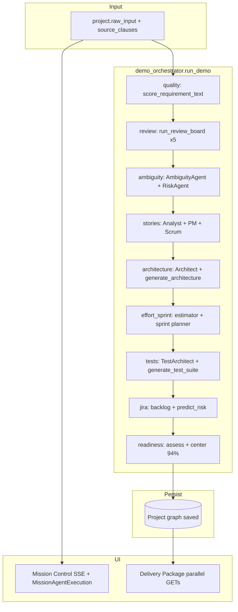

# Phase 5 — AI Workflow Audit

**Project:** Helix (AI-Thon)  
**Date:** 2026-05-22  
**Scope:** PM, Architect, QA, Scrum, Risk, and Quality agents on the **golden path** (`POST /api/demo/{id}/run` → persist → Delivery Package)  
**Method:** Static trace of `helix-backend/app/agents/*`, `demo_orchestrator.py`, `services/*`, and UI mapping in `missionAgents.js` + `DeliveryPackage.jsx`

---

## Executive summary

| Agent (product) | Backend module | Model call | Output → DB | UI render | Verdict |
|-----------------|----------------|------------|-------------|-----------|---------|
| **Quality** | `quality_scorer.py` | AIService (optional) + heuristics | `project.quality_score_report` | SSE artifact only; not on Delivery Package | **PASS** (hybrid) |
| **PM** | `requirement_analyst`, `product_manager`, `review_board` | LLM JSON + mock fallback | `stories`, `summary`, `pipeline_epic`, `requirement_brief` | Mission Control + Package sections | **PASS** (with gaps) |
| **Architect** | `solution_architect` + `architecture_generator` | LLM + heuristics/AI diagram | `architecture_brief`, `architecture_diagram` | Package (Mermaid) | **PASS** (duplicate paths) |
| **QA** | `test_architect` + `test_suite_generator` | AIService or LLM + suite gen | `test_cases`, `generated_test_suite` | Package (G/W/T) | **PASS** (dual generators) |
| **Scrum** | `scrum_master`, `effort_estimator`, `auto_sprint_planner` | LLM + heuristics | `tasks`, `sprint_plan`, `auto_sprint_plan` | Package sprint section | **WARN** (0 tasks observed in Phase 3) |
| **Risk** | `risk`, `ambiguity`, `predict_risk` | LLM + service | `risks`, `ambiguities`, `requirement_risk` | Package risks (partial) | **PASS** (split across steps) |

**Cross-cutting**

| Check | Status |
|-------|--------|
| Inputs grounded in `project.raw_input` / clauses | **PASS** |
| Prompts include schema hints + “do not invent scope” | **PASS** |
| Structured JSON parsing | **PASS** (`_safe_json` + Pydantic/coercion) |
| Hallucinated field rejection | **PARTIAL** (tests validate `story_id`; tasks do not) |
| Per-step error handling (orchestrator) | **PASS** (yields `error`, continues run) |
| Retry on transient API failures | **PARTIAL** (AIService yes; LLMService no) |
| UI handles SSE `error` status | **FAIL** (not mapped in `missionAgents.js`) |
| Judge readiness score | **WARN** (hardcoded 94% in orchestrator) |

---

## Pipeline map (Input → UI)



---

## Shared infrastructure

### Input

| Source | Used by |
|--------|---------|
| `project.raw_input` | All steps via `_project_text()` |
| `project.source_clauses` | Ingest, agents via `render_clauses()` |
| `requirement_brief` | PM chain (analyst → PM) |
| `stories` | QA, Scrum, backlog |

**Validation:** Ingest step normalizes text into clauses; downstream prompts consistently include clause blocks. **Correct.**

### Model call layer

| Layer | File | Retry | Fallback |
|-------|------|-------|----------|
| **LLMService** | `services/llm.py` | **No** (single try, logs + raise) | `mock_agents.synthetic_json` via `chat_json_with_fallback` |
| **AIService** | `services/ai_service.py` | **Yes** — `@retry` 3× exponential on `_chat_json` | Raises if disabled (callers catch) |
| **Streaming** | `ai_service.stream_chat` | Manual 3-attempt loop on retryable errors | N/A |

**Finding:** Most pipeline agents use **`get_llm().chat_json_with_fallback`**, not `AIService`. Transient Azure errors on those agents are **not retried** unless the call happens to go through `AIService` (Ambiguity, TestArchitect when AI enabled).

### Output parsing

| Pattern | Behavior | Risk |
|---------|----------|------|
| `_safe_json` (llm + ai_service) | Strip fences, extract `{…}` | Empty `{}` on parse failure → **silent empty lists** |
| `try/except` per row | Invalid enum/row skipped | **Silent drop**, not surfaced to UI |
| Pydantic models | `UserStory`, `Risk`, `TestCase`, etc. | Extra LLM keys ignored if not in constructor |

### Orchestrator error policy

```556:606:helix-backend/app/services/demo_orchestrator.py
        try:
            result = await runner(project, percent=done_pct, **kwargs)
            ...
            yield result
        except Exception as exc:
            ...
            yield _event(
                step=step_id,
                status="error",
                ...
            )
```

Steps **continue** after `error`. UI **`applyDemoEvent` does not handle `status: 'error'`** — step may appear stuck or complete without marking failure.

---

## Agent-by-agent audit

### 1. Quality Agent (`quality` step)

**Implementation:** `services/quality_scorer.py` — not an `Agent` subclass.

| Stage | Detail |
|-------|--------|
| **Input** | Full requirement text (`_project_text`); truncated to 8000 chars for AI |
| **Prompt** | `_AI_SYSTEM` + `_AI_SCHEMA`; heuristic lexicons for vague terms & dimensions |
| **Model** | `_ai_analysis()` → `AIService.complete_json` when `use_ai=True` and configured; else **heuristic-only** (`method: "heuristic"`) |
| **Output** | `QualityScoreReport` on `project.quality_score_report`; SSE artifact with clarity/completeness/testability/grade/gaps |
| **UI** | Mission Control logs via `STEP_LOG.quality`; **not shown on Delivery Package** (no dedicated quality section) |

**Validation**

| Check | Result |
|-------|--------|
| Inputs correct | **PASS** |
| Outputs parsed | **PASS** — `_merge_missing`, `_merge_vague`, dimension coercion |
| Hallucinated fields | **LOW RISK** — AI dims merged only known keys; highlights from merged gaps |
| Error handling | **PASS** — AI failure logs and falls back to heuristics |
| Retry | **PASS** on AI path (AIService tenacity) |

**Gaps:** Quality score is **invisible** on Delivery Package after run. PM Agent UI owns the step narratively.

---

### 2. PM Agent (ingest, quality, review, ambiguity, stories)

#### 2a. Requirement Analyst (`RequirementAnalystAgent`)

| Stage | Detail |
|-------|--------|
| **Input** | `render_clauses(project.source_clauses)` |
| **Prompt** | `SYSTEM` + `SCHEMA` (features, actors, business_rules, …) |
| **Model** | `llm.chat_json_with_fallback("requirement_analyst", …)` |
| **Output** | `project.requirement_brief` |
| **When** | `_step_stories` if brief missing |

**Validation:** Grounding instruction present. Invalid rows skipped in `try/except`. **PASS.**

#### 2b. Product Manager (`ProductManagerAgent`)

| Stage | Detail |
|-------|--------|
| **Input** | Analyst intake block + clauses |
| **Prompt** | Epic + INVEST stories + AC; explicit “Do NOT output engineering tasks” |
| **Model** | `chat_json_with_fallback`, max 6000 tokens |
| **Output** | `pipeline_epic`, `stories[]`, `summary` |

```112:126:helix-backend/app/agents/product_manager.py
        for s in data.get("stories") or []:
            try:
                stories.append(
                    UserStory(
                        title=s.get("title", "Untitled story"),
                        ...
                        source_clause_ids=list(s.get("source_clause_ids") or []),
                    )
                )
            except Exception:
                continue
```

**Hallucination:** Unknown story fields dropped. **`source_clause_ids` not validated** against real clause IDs (may cite fake `clause_*`). **WARN.**

#### 2c. Multi-Agent Review Board (`review_board.py`)

| Stage | Detail |
|-------|--------|
| **Input** | Clauses for all 5 reviewers |
| **Prompt** | BA, Architect, QA, Security, PM — parallel `asyncio` |
| **Model** | Five `chat_json_with_fallback` calls |
| **Output** | `ReviewBoardReport` — weighted confidence + grade |
| **UI** | SSE `review` artifact (reviewer summaries); PM lane in Mission Control |

**Error handling:** Per-agent failure → `AgentReview` score **40.0** with error string. **PASS.**

**Retry:** None on LLM. **WARN.**

#### 2d. Stories step orchestration

Runs: Analyst (optional) → PM → **ScrumMaster** (tasks). PM Agent in UI also owns **ambiguity** sub-steps.

**Phase 3:** 5 stories, **0 tasks** — Scrum output or task persistence issue.

---

### 3. Architect Agent (`architecture`, `apis`)

#### 3a. Solution Architect (`SolutionArchitectAgent`)

| Stage | Detail |
|-------|--------|
| **Input** | Clauses + PM epic/stories summary |
| **Prompt** | APIs, components, data entities, NFRs, decisions |
| **Model** | `chat_json_with_fallback` |
| **Output** | `project.architecture_brief` |

#### 3b. Architecture generator (`generate_architecture`)

| Stage | Detail |
|-------|--------|
| **Input** | Raw requirement text |
| **Model** | Pattern heuristics + optional AI via `diagram_generator` / AIService |
| **Output** | `project.architecture_diagram` (layers, Mermaid) |

**Duplicate work:** Brief from agent, diagram from service — **both run every demo**. Diagram is what **Delivery Package** renders (`MermaidView`). Brief may be underused in UI.

**Validation:** **PASS** for parsing; **WARN** on redundant LLM/heuristic paths and cost.

#### 3c. APIs step (`generate_contracts`)

Separate service step; mapped to **Architect** lane in `missionAgents.js`. **PASS** with `use_ai` flag.

---

### 4. QA Agent (`tests`)

#### 4a. Test Architect (`TestArchitectAgent`)

| Stage | Detail |
|-------|--------|
| **Input** | Serialized stories with AC |
| **Prompt** | `TESTCASE_SYSTEM` / `testcase_prompt` or inline SYSTEM + SCHEMA |
| **Model** | **AIService** if enabled, else `llm.chat_json_with_fallback` |
| **Output** | `project.test_cases[]` (Given/When/Then) |

```86:92:helix-backend/app/agents/test_architect.py
        story_ids = {s.id for s in project.stories}
        ...
                sid = t.get("story_id")
                if sid not in story_ids:
                    sid = None
```

**Hallucination guard:** Invalid `story_id` nulled — **good**. Invalid `type` enum may skip row in `try/except`.

#### 4b. Test suite generator (`generate_test_suite`)

Runs **after** TestArchitect; populates `generated_test_suite` (categorized groups). SSE headline uses **both** counts.

**UI:** `DeliveryPackage.formatTestBody` supports `given`/`when`/`then` and legacy `steps`. **PASS.**

**Gap:** If `TestArchitect` returns `[]` and suite generator fills categories, BDD count in headline may disagree with `test_cases` length (Phase 3: 20 tests).

---

### 5. Scrum Agent (`effort_sprint`, `jira`)

#### 5a. Scrum Master (`ScrumMasterAgent`)

| Stage | Detail |
|-------|--------|
| **Input** | Story block with ids and AC |
| **Prompt** | Tasks ≤1 day, dependencies, sprint allocation |
| **Model** | `chat_json_with_fallback` |
| **Output** | `tasks`, `sprint_plan` |

Post-processing:

1. **`EstimatorAgent`** may replace tasks with estimated versions.
2. If no sprint `items`, **`_heuristic_plan`** fallback.

**Hallucination:** `story_id` / `dependencies` **not validated** against known ids. Invalid tasks **skipped silently**. **WARN** — aligns with Phase 3 **0 tasks**.

#### 5b. Effort + sprint (`effort_sprint` step)

`estimate_effort_for_project` + `plan_sprint_from_requirement` — additional services with `use_ai`. Persisted: `requirement_estimate`, `auto_sprint_plan`.

**UI:** Package loads `/sprint-plan/{id}/auto`. **PASS** when data exists.

#### 5c. Jira step (`predict_risk`)

`predict_risk` runs here — **not** the same as `RiskAgent` (which runs in `ambiguity`). UI log says “risk analysis & backlog” for `jira` step. **Naming confusion only.**

---

### 6. Risk Agent

#### 6a. Risk (`RiskAgent`) — in `_step_ambiguity`

| Stage | Detail |
|-------|--------|
| **Input** | Summary + clauses |
| **Prompt** | NFR risks with category, severity, mitigation |
| **Model** | `chat_json_with_fallback` |
| **Output** | `project.risks[]` |

Wrapped in **try/except** in orchestrator — failure leaves prior risks empty. **PASS** for isolation.

#### 6b. Ambiguity (`AmbiguityAgent`) — same step

Uses **AIService** when enabled; maps unknown kinds via `_KIND_FROM_LLM`. **PASS.**

**UI:** Risks merged from `studio/risk`, `risk-center`, PRD, readiness blockers in `DeliveryPackage`. Ambiguities **not** dedicated section on package page. **GAP.**

---

## UI rendering validation

### Mission Control (`missionAgents.js` + `MissionAgentExecution`)

| Check | Result |
|-------|--------|
| SSE `running` / `done` | **PASS** |
| SSE `error` | **FAIL** — no branch; step not added to `completedSteps` |
| Agent lane mapping | **PASS** (PM/Architect/QA/Scrum) |
| `boot` / `persist` | Partially ignored (percent only) |
| Pipeline strip | `pipelineIdForDemoStep` — quality/review map to PM |

### Delivery Package

| Section | API | Renders agent output? |
|---------|-----|------------------------|
| Executive summary | artifacts, prd (404) | Stories/summary fallback |
| User stories | `artifacts.stories` | **PASS** |
| Sprint | `sprint-plan/auto` | **PASS** if plan exists |
| Architecture | `studio/diagram` | **PASS** (Mermaid) |
| Test cases | `testcases` | **PASS** (G/W/T) |
| Risks | risk + readiness | **PASS** (aggregated) |
| Export | backlog CSV | **PASS** |

**Not rendered:** `quality_score_report`, `review_board_report`, `ambiguities[]`, `generated_test_suite` categories, API contracts detail.

### Judge Demo (`WinningDemoScreen`)

Uses same SSE stream; `JUDGE_READINESS_SCORE = 94` constant for finale ring — may **diverge** from API readiness if demo incomplete.

---

## Hallucination & field integrity

| Mechanism | Agents affected | Effectiveness |
|-----------|-----------------|---------------|
| Schema hints in prompt | All LLM agents | **Medium** — relies on model |
| `source_clause_ids` in schema | PM, Risk, Ambiguity, Tests | **Not validated** against clause list |
| `story_id` check | TestArchitect only | **Good** |
| Enum coercion + skip | Risk, Ambiguity, PM, Scrum | **Good** — silent drop |
| Heuristic/mock fallback | All via `synthetic_json` | **Deterministic** — no hallucination, generic content |
| Readiness **94** forced | `demo_orchestrator._step_readiness` | **Display hallucination** for judges |

```504:506:helix-backend/app/services/demo_orchestrator.py
    center = await build_readiness_center(project, use_ai=False)
    center.readiness = 94
    center.status_label = "PROJECT READY"
```

---

## Retry logic summary

| Code path | Retry |
|-----------|-------|
| `AIService._chat_json` | 3 attempts, exponential backoff |
| `AIService.stream_chat` | 3 attempts manual |
| `LLMService.chat_json` | **None** |
| `demo_orchestrator` step | **None** (single attempt per step) |
| Review board per agent | **None** |

**Recommendation:** Add tenacity to `LLMService.chat_json` or route all agents through `AIService.complete_json`.

---

## Findings by severity

### High

| ID | Finding | Recommendation |
|----|---------|----------------|
| H1 | UI ignores SSE `status: 'error'` | Handle in `applyDemoEvent`; show toast + mark agent failed |
| H2 | `LLMService` has no retry | Align with AIService retry policy |
| H3 | Readiness **hardcoded 94%** | Use `assess_readiness` score or cap mock; bind Judge UI to API |

### Medium

| ID | Finding | Recommendation |
|----|---------|----------------|
| M1 | **0 tasks** after Scrum (Phase 3) | Validate `story_id`; log skipped tasks; fix Estimator interaction |
| M2 | Duplicate generators (arch, tests) | Run architect OR generator; merge test paths |
| M3 | `source_clause_ids` not validated | Filter against `project.source_clauses` ids |
| M4 | Empty JSON `{}` → empty artifacts | Surface parse failure in SSE `error` |
| M5 | Quality/review not on Delivery Package | Add summary cards or link to workspace |

### Low

| ID | Finding | Recommendation |
|----|---------|----------------|
| L1 | Risk runs in `ambiguity` but narrated on `jira` | Rename logs or split SSE step |
| L2 | `use_ai` in UI always `true` (Mission Control) vs tests with `false` | Env toggle or label “fast mode” |
| L3 | PRD endpoint 404 | Implement `GET /delivery/prd/{id}` or remove section |

---

## Test matrix (recommended)

| Case | Agent | Expected |
|------|-------|----------|
| Empty requirement | All | Graceful scores / empty lists, no crash |
| `use_ai=false` | All | Mock JSON from `mock_agents.py` |
| Invalid Azure key | LLM agents | Fallback mock or step `error` |
| Rate limit 429 | AIService | Retry then success or error event |
| Single-story project | QA/Scrum | ≥1 test, ≥1 task |
| Clause-less project | Ingest | Clauses generated from text |

---

## Reproduce

```powershell
# Full pipeline trace (mock, ~3–4 min)
cd helix-backend; .\run.ps1
python scripts/phase3_workflow_test.py

# With live LLM
$env:HELIX_USE_AI="true"
python scripts/phase3_workflow_test.py
```

Inspect persisted project:

```
GET /api/artifacts/{id}
GET /api/testcases/{id}
GET /api/readiness-center/{id}
```

---

## Sign-off

| Criterion | Verdict |
|-----------|---------|
| Inputs correct | **PASS** |
| Prompts present & scoped | **PASS** |
| Model calls wired | **PASS** (mock + Azure) |
| Outputs parsed | **PASS** (silent drops possible) |
| No hallucinated **stored** fields | **PARTIAL** |
| Error handling (backend) | **PASS** |
| Retry logic | **PARTIAL** |
| UI rendering | **PASS** with gaps (errors, quality, ambiguities) |

**Overall:** Agents are **architecturally sound** for demo reliability (fallback + tolerant orchestrator). Production hardening needs **UI error states**, **LLM retries**, **task generation fix**, and **removal of hardcoded readiness**.
