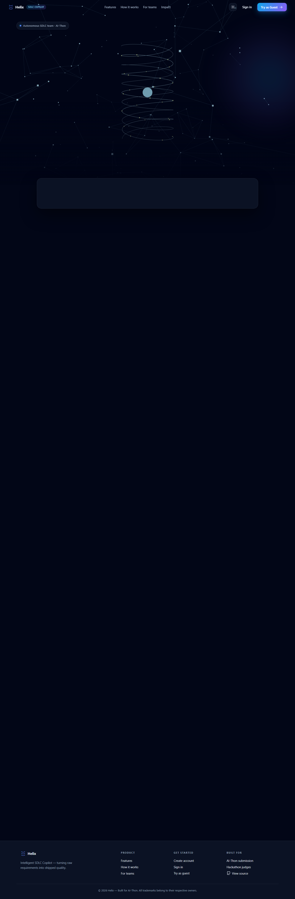
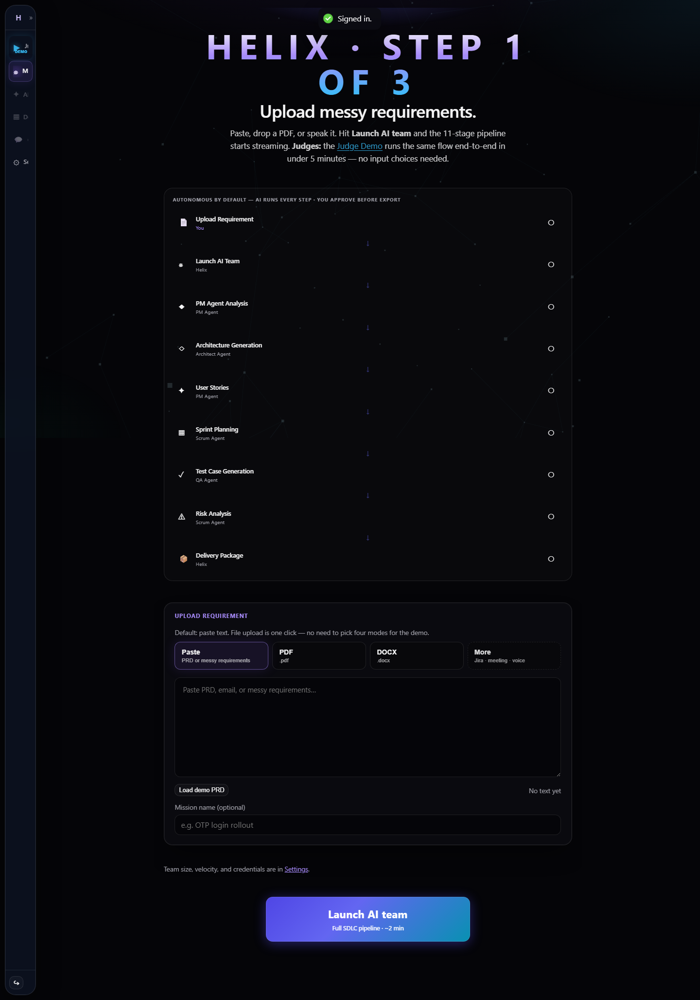
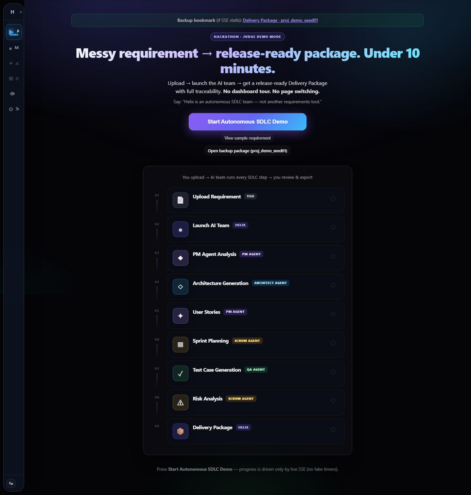
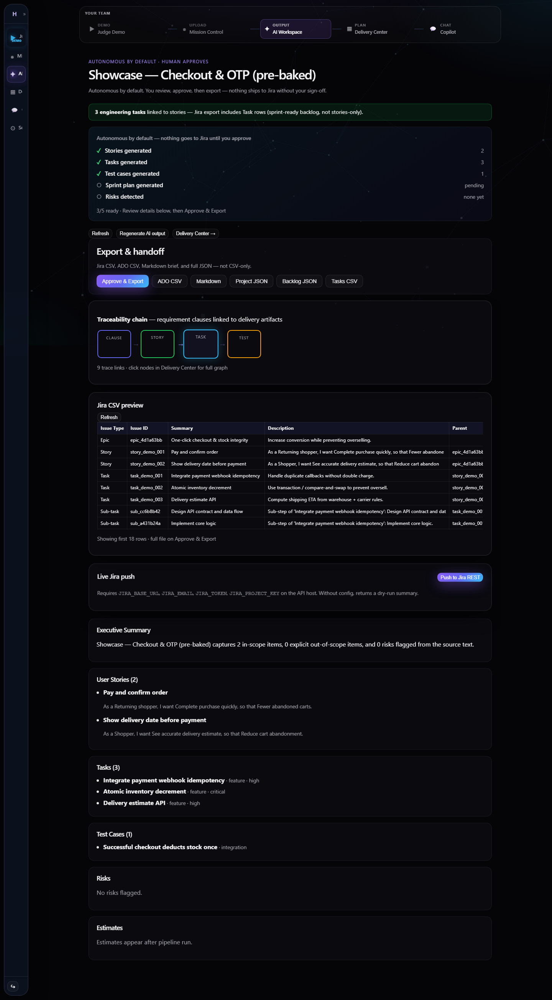
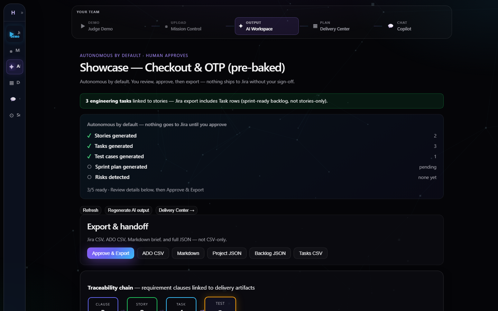
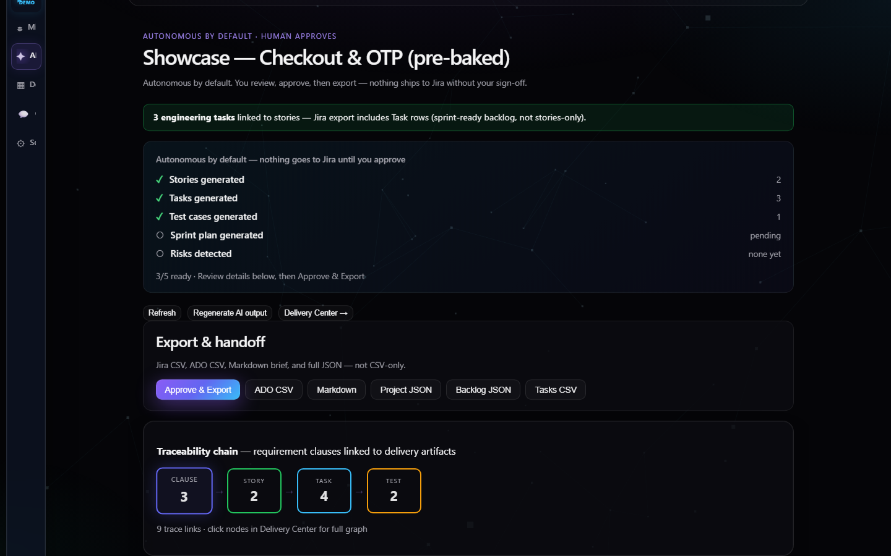
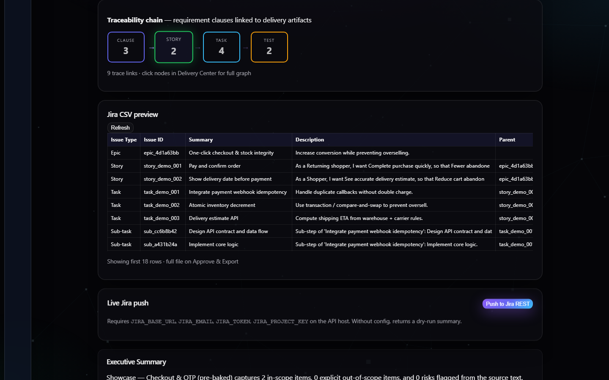

# Helix — Screenshot Tour (for async judges & static reviewers)

> **Read this if you're not running the app.** Every screenshot below
> is a real capture of the seeded demo project `proj_demo_seed01`
> running through the **canonical e-commerce checkout** golden domain
> (see [`docs/GOLDEN_DOMAIN.md`](GOLDEN_DOMAIN.md)). No mock-ups, no
> stock UI imagery — what you see is what a judge running the app sees.

**Companion docs:**
[`README.md`](../README.md) ·
[`docs/DEMO_SCRIPT.md`](DEMO_SCRIPT.md) ·
[`docs/JUDGE_MODE.md`](JUDGE_MODE.md) ·
[`docs/DEMO_RECOVERY.md`](DEMO_RECOVERY.md) *(the 4-tier fallback playbook — this tour is Tier C)* ·
[`docs/NOVELTY.md`](NOVELTY.md) ·
[`docs/GOLDEN_DOMAIN.md`](GOLDEN_DOMAIN.md) ·
[`docs/sample-exports/`](sample-exports/) *(Tier D — committed deliverables)* ·
[`PRESENTER_CHEATSHEET.md`](../PRESENTER_CHEATSHEET.md)

> **Pre-recorded video fallback (Tier C++):** Same flow as the 7
> frames below but as a 22-second WebM you can play in any browser /
> VLC: [`helix-frontend/docs/judge-screenshots/judge-walkthrough.webm`](../helix-frontend/docs/judge-screenshots/judge-walkthrough.webm)
> (~2 MB). Use this if your screen-sharing tool struggles to render
> the live React app.

---

## The judge journey in 7 frames

> **Narrative beat (memorize this):** *Upload messy requirements →
> launch the AI team → get a release-ready delivery package with full
> traceability. Under 10 minutes.*

### 1. Landing — the entry point



**What to look for:** the GSAP / Three.js **HeroHelix** spiral and
particle field render at the top, anchored to the tagline *"Upload
messy requirements → launch the AI team → get a release-ready delivery
package with full traceability."* Top-right CTAs let a judge **Try as
Guest** without signup — the lowest-friction path into the demo.

---

### 2. Mission Control — the launchpad



**What to look for:** the **STEP 1 OF 3** eyebrow + ingest tile (paste,
PDF, URL, or voice via Web Speech API). One button — **Launch AI
Team** — kicks off the 11-stage SSE pipeline. Per-stage `elapsed_ms`
streams into a live timeline (visible in §3 below). This is the only
place where the user does any work; everything downstream is
auto-generated.

---

### 3. Judge Demo — the autonomous SDLC mode



**What to look for:** the **HACKATHON · JUDGE DEMO MODE** badge plus
the core narrative ("Messy requirement → release-ready package. Under
10 minutes."). The pipeline is rendered as a 9-stage vertical timeline
(`Upload Requirement → Launch AI Team → PM Agent Analysis →
Architecture Generation → User Stories → Sprint Planning → Test Case
Generation → Risk Analysis → Delivery Package`). Each stage gets a
checkpoint indicator that fills as the SSE event arrives — judges can
*see* the AI team working in real time. **No fake timers** — copy
beneath the timeline calls this out explicitly.

> **Backup bookmark** at the top: *"if SSE stalls: Delivery Package -
> proj_demo_seed01"* — the unembarrassable fallback path documented in
> [`docs/JUDGE_MODE.md`](JUDGE_MODE.md).

---

### 4. Delivery Package — the release-ready output (the money shot)



**This is the one screen that answers "did it actually work?".** One
full-page scroll, every artifact:

| Region | What it proves |
|---|---|
| **"3 engineering tasks linked to stories"** banner | Tasks are concrete (not "build feature X"), per-story, Jira-ready |
| **Approval checklist** — Stories ✓ · Tasks ✓ · Test cases ✓ | The human-in-the-loop gate is one click; nothing exports without sign-off |
| **Export & handoff** — Jira CSV · ADO CSV · Markdown · Project JSON · Backlog JSON · Tasks CSV | Six concrete export formats, all generated from the same in-memory `Project` graph |
| **Traceability chain — 3 clauses → 2 stories → 4 tasks → 2 tests** | Provenance pillar in action; 9 trace links visible |
| **Jira CSV preview** — Epic / Story / Story / Task / Task / Task / Sub-task / Sub-task | Judges can literally read the rows that would land in Jira |
| **Executive Summary · User Stories · Tasks · Test Cases · Risks · Estimates** | Six standard SDLC sections, all populated, all on one scrollable page |

---

### 5. Export hub — Jira / ADO / GitHub / CSV in one place



**What to look for:** the **Approve & Export** primary action is the
governance gate — `?approved_only=true` on `/api/export` filters out
anything not toggled to `approved_for_export`. Six button options
across the secondary row cover every common SDLC destination. *"Jira,
ADO, Markdown brief, and full JSON — not CSV-only"* is the literal
sub-headline.

---

### 6. Traceability chain — the provenance pillar visualized



**What to look for:** **CLAUSE 3 → STORY 2 → TASK 4 → TEST 2** with
**9 trace links**. Each card is colour-coded by lane (purple /
emerald / cyan / amber) so judges can pattern-match the chain
visually. *"Click nodes in Delivery Center for full graph"* is the
upgrade path to the interactive trace explorer. This is the visual
form of [`docs/NOVELTY.md`](NOVELTY.md) Pillar 1 — provenance you can
prove, not citations you have to trust.

---

### 7. Jira CSV preview — the exported result, inline



**The single screenshot that answers "did the export work?".** All
five Jira columns visible (Issue Type · Issue ID · Summary ·
Description · Parent). Eight rows shown — `Epic` → 2 `Story` rows →
3 `Task` rows → 2 `Sub-task` rows — with **real summaries** ("One-click
checkout & stock integrity", "Pay and confirm order", "Atomic
inventory decrement", "Delivery estimate API", …) and the **parent
link** column populated so Jira import preserves the hierarchy.
*"Showing first 18 rows · full file on Approve & Export"* tells the
judge there's a real CSV behind the preview.

> Beneath this panel sits **Live Jira push** with a `Push to Jira REST`
> button — if `JIRA_BASE_URL / JIRA_EMAIL / JIRA_TOKEN / JIRA_PROJECT_KEY`
> are configured on the API host, it pushes directly; otherwise it
> returns a dry-run summary. No CSV download dance required.

---

## What the screenshots prove (rubric mapping)

| Rubric criterion | The frame that proves it |
|---|---|
| **Functional MVP** — does the core flow actually work? | Frame 4 (Delivery Package full scroll) + Frame 7 (Jira CSV with real rows) |
| **Innovation / Novelty** — clause traceability | Frame 6 (3 clauses → 2 stories → 4 tasks → 2 tests, 9 trace links) |
| **Innovation / Novelty** — autonomous AI team | Frame 3 (9-stage pipeline with named agents) |
| **Presentation / Story** — clear narrative | Frame 1 (tagline), Frame 3 (core narrative repeated), Frame 4 (one-screen result) |
| **Impact / Market fit** — release-ready output | Frame 4 + Frame 5 (six export formats including Jira) |
| **Theme alignment** — AI for SDLC productivity | Frame 4 — every SDLC artifact (stories, tasks, tests, risks, estimates, sprint plan, PRD-grade summary) on one screen |

---

## How these screenshots are made (the reproducer)

**Source of truth:** [`helix-frontend/e2e/judge-snapshot.spec.ts`](../helix-frontend/e2e/judge-snapshot.spec.ts)
— a Playwright spec that logs in, navigates to the seeded showcase
project, and writes seven PNGs into
`helix-frontend/docs/judge-screenshots/`.

**To regenerate them locally:**

```powershell
# Terminal A — backend on :8765
cd helix-backend
.\run.ps1

# Wait ~30 s for seed.py to finish, then in Terminal B:
cd helix-frontend
npm run dev          # Vite on http://localhost:5173

# Terminal C (or after closing Vite watch and using a fresh window):
cd helix-frontend
$env:E2E_SKIP_WEB_SERVER='1'
$env:E2E_BASE_URL='http://localhost:5173'
$env:E2E_BACKEND_URL='http://127.0.0.1:8765'
npx playwright test e2e/judge-snapshot.spec.ts --project=chromium
```

Expected output (≈22 s end-to-end):

```
[judge-snapshot] saved docs\judge-screenshots\01-landing.png
[judge-snapshot] saved docs\judge-screenshots\02-mission-control.png
[judge-snapshot] saved docs\judge-screenshots\03-judge-demo.png
[judge-snapshot] saved docs\judge-screenshots\04-delivery-package--full.png
[judge-snapshot] saved docs\judge-screenshots\05-export-hub.png
[judge-snapshot] saved docs\judge-screenshots\06-traceability.png
[judge-snapshot] saved docs\judge-screenshots\07-jira-csv-preview.png
[judge-snapshot] saved ..\docs\sample-exports\checkout-revamp.tasks.csv (596 bytes)
[judge-snapshot] saved ..\docs\sample-exports\checkout-revamp.jira.csv (4000 bytes)
[judge-snapshot] saved ..\docs\sample-exports\checkout-revamp.azure-devops.csv (3636 bytes)
[judge-snapshot] saved ..\docs\sample-exports\checkout-revamp.brief.md (2009 bytes)
[judge-snapshot] saved ..\docs\sample-exports\checkout-revamp.backlog.json (16390 bytes)
[judge-snapshot] copied video → docs\judge-screenshots\judge-walkthrough.webm
  1 passed
```

The single spec produces **three deliverable kinds in one pass**:

1. **7 PNG screenshots** in `helix-frontend/docs/judge-screenshots/`
   (this tour picks them up automatically).
2. **1 WebM video** at `helix-frontend/docs/judge-screenshots/judge-walkthrough.webm`
   (~2 MB, plays in any browser/VLC — *Tier C* of
   [`DEMO_RECOVERY.md`](DEMO_RECOVERY.md)).
3. **5 export artefacts** in `docs/sample-exports/` — full Jira CSV
   (Epic→Story→Task→Sub-task), ADO CSV, tasks-only CSV, markdown
   brief, backlog JSON (*Tier D* of [`DEMO_RECOVERY.md`](DEMO_RECOVERY.md)).

> **Note on Vite host:** Vite binds to `localhost` (not
> `127.0.0.1`). The `E2E_BASE_URL` override above is necessary; the
> default `playwright.config.ts` points at `127.0.0.1` which won't
> resolve to a Vite dev server.

---

## When to use this document

- **You're reviewing the repo without running the app.** Read this
  end-to-end; it's a 3-minute reading of the actual product.
- **The live demo is offline / between deploys.** Open this URL in a
  separate tab during the pitch so judges can follow along visually
  while you talk.
- **You want to compose the deck.** Drop frames 1, 3, 4, 7 directly
  into [`PRESENTATION.md`](../PRESENTATION.md) slides 1 / 4 / 5 / 6.
- **You're proving the *Functional MVP* criterion.** Frame 4 + the
  CI-gated golden-pipeline contract in [`docs/GOLDEN_DOMAIN.md`](GOLDEN_DOMAIN.md)
  is the two-piece answer.

---

## Companion artefacts

- **Demo recovery playbook** — the 4-tier fallback model. This tour is
  Tier C; committed exports are Tier D: [`docs/DEMO_RECOVERY.md`](DEMO_RECOVERY.md).
- **Committed deliverables** — the real Jira/ADO CSVs, markdown brief,
  and backlog JSON pulled from the live API: [`docs/sample-exports/`](sample-exports/).
- **Empty-state UI verification** (the original Phase 2 baseline, used
  to validate responsive layout / overflow / theme): [`docs/PHASE2_UI_VERIFICATION.md`](PHASE2_UI_VERIFICATION.md)
  — references `helix-frontend/docs/phase2-screenshots/`.
- **Live demo script** (60-second pitch, anchored to the same sample
  requirement): [`docs/DEMO_SCRIPT.md`](DEMO_SCRIPT.md).
- **Offline-safe one-command demo launcher**: [`docs/JUDGE_MODE.md`](JUDGE_MODE.md),
  `scripts/judge_demo.ps1` / `scripts/judge_demo.sh`.
