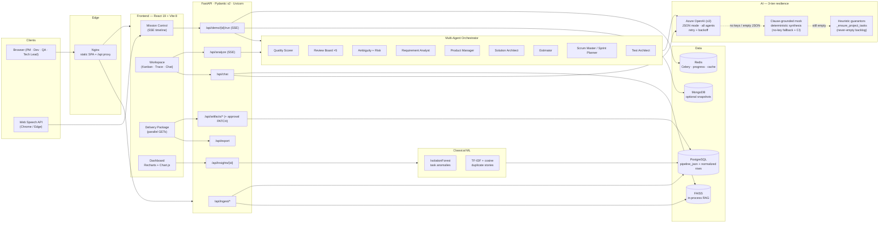
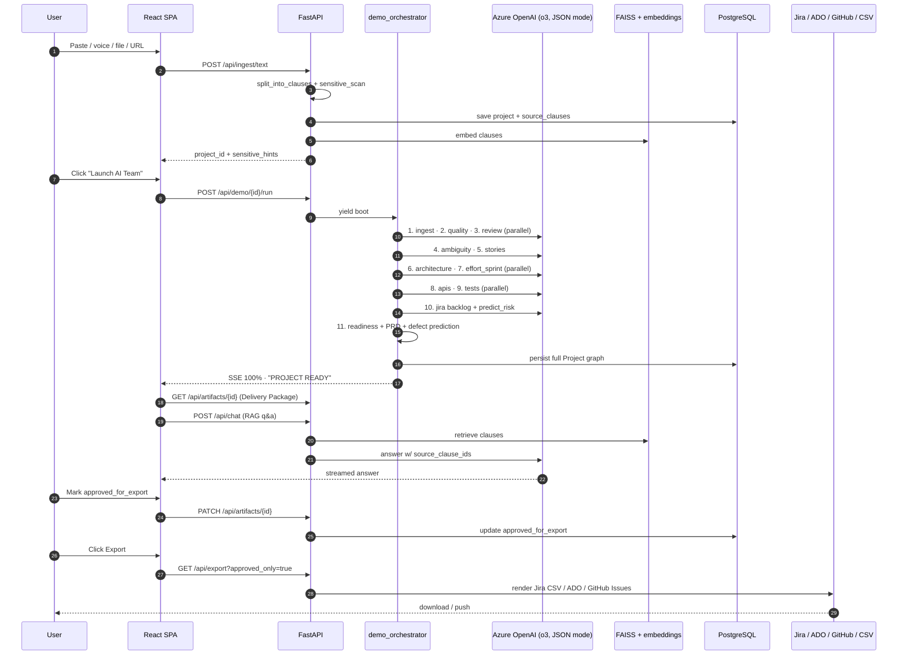

# Helix — End-to-end Workflow

> **One canonical doc.** Mirrors the code in
> `helix-backend/app/services/demo_orchestrator.py` (the 11-step demo
> pipeline) and `helix-backend/app/agents/orchestrator.py` (the 5-stage
> `/api/analyze` pipeline). Diagrams are authored in **eraser.io** and
> re-rendered here as Mermaid so they show up on GitHub.

**Diagram source:** [`docs/helix-workflow.eraser`](./helix-workflow.eraser)
— paste into <https://app.eraser.io> ("New file → Diagram-as-Code") to
re-render the two diagrams below.

**Related docs:**
[`docs/RUNBOOK.md`](./RUNBOOK.md) · [`ARCHITECTURE.md`](../ARCHITECTURE.md) ·
[`docs/PHASE3_WORKFLOW_EXECUTION.md`](./PHASE3_WORKFLOW_EXECUTION.md) ·
[`docs/PHASE5_AI_WORKFLOW_AUDIT.md`](./PHASE5_AI_WORKFLOW_AUDIT.md)

---

## 1. Workflow at a glance

Helix turns raw product input into a **traceable graph** of stories,
tasks, tests, ambiguities, and risks, then exports to Jira / ADO /
GitHub / CSV. Every artifact cites the source clause IDs it came from
(`source_clause_ids`).

There are **two entry points** into the multi-agent runtime:

| Entry point | Route | Purpose | Stages |
|---|---|---|---|
| **Mission Control / Winning Demo** | `POST /api/demo/{id}/run` (SSE) | Full “autonomous SDLC demo” — single click → 11 streamed stages → Delivery Package | 11 (see §3) |
| **Workspace generation** | `POST /api/analyze` (SSE) | Iterative refinement inside a project (per-tab) | 5 (Analyst → PM → Architect → QA → Scrum) |
| **Copilot chat** | `POST /api/chat` (token stream) | RAG-grounded Q&A over project clauses | n/a |

Both pipelines write to the **same `Project` graph** (`pipeline_json` in
Postgres, plus normalized rows for requirements / artifacts / tests).

---

## 2. System architecture (mirrors `helix-workflow.eraser`)



---

## 3. The 11-step demo pipeline (`/api/demo/{id}/run`)

Source of truth: `DEMO_STEPS` and `_STEP_RUNNERS` in
[`helix-backend/app/services/demo_orchestrator.py`](../helix-backend/app/services/demo_orchestrator.py).

| # | Step id | Agents / services | Persists | UI surface |
|---|---|---|---|---|
| 1 | `ingest` | `split_into_clauses` + `sensitive_scan` | `source_clauses` | Mission Control timeline · ingest preview |
| 2 | `quality` | `quality_scorer.score_requirement_text` (heuristic + optional `AIService`) | `quality_score_report` | Mission Control PM lane log |
| 3 | `review` | `review_board` — BA · Architect · QA · Security · PM (5× parallel LLM) | `review_board_report` | Mission Control PM lane log |
| 4 | `ambiguity` | `AmbiguityAgent` + `RiskAgent` | `ambiguities[]`, `risks[]` | Workspace ambiguity heat-map · risk center |
| 5 | `stories` | `RequirementAnalystAgent` → `ProductManagerAgent` → `ScrumMasterAgent` (+ `EstimatorAgent`) | `requirement_brief`, `pipeline_epic`, `stories[]`, `tasks[]`, `summary` | Workspace stories · Kanban · Delivery Package |
| 6 | `architecture` | `SolutionArchitectAgent` + `generate_architecture` (heuristics → Mermaid) | `architecture_brief`, `architecture_diagram` | Delivery Package — Mermaid render |
| 7 | `effort_sprint` | `estimate_effort_for_project` + `plan_sprint_from_requirement` | `requirement_estimate`, `auto_sprint_plan` | Delivery Package — sprint board |
| 8 | `apis` | `generate_contracts` | `api_contracts` | Delivery Package — API specs (OpenAPI-ready) |
| 9 | `tests` | `TestArchitectAgent` (Azure JSON, mock + heuristic fallback) + `generate_test_suite` | `test_cases[]` (G/W/T), `generated_test_suite` (categorized) | Delivery Package — test cards |
| 10 | `jira` | `generate_backlog` + `build_traceability` + `predict_risk` | `jira_backlog` (Epic → Stories → Tasks → Subtasks), `traceability_matrix`, `requirement_risk` | Export hub — Jira CSV · ADO CSV · REST push |
| 11 | `readiness` | `assess_readiness` + `build_readiness_center` + `predict_defects` + `generate_prd_for_project` | `delivery_readiness`, `delivery_readiness_center`, `defect_prediction`, `prd_document` | Delivery Package — release-gate score + blockers |

`boot` is emitted before step 1; `error` events never abort the run
(the orchestrator continues so judges always see step 11).

### Parallel batches

Set `HELIX_DEMO_PARALLEL=true` to enable the Phase-2 parallel
orchestrator (`_PARALLEL_BATCHES`):

```
(quality      || review)
(architecture || effort_sprint)
(apis         || tests)
```

The remaining steps run sequentially. The full 11-step plan still emits
the same SSE event stream — only `headline` changes to `Running: <step>
(parallel)` for batch members.

### Sequence diagram (mirrors `helix-workflow.eraser`)



---

## 4. The 5-stage workspace pipeline (`/api/analyze`)

Source: `CONTROL_TOWER_STAGES` in
[`helix-backend/app/agents/orchestrator.py`](../helix-backend/app/agents/orchestrator.py).
This is the iterative pipeline behind **Workspace → Generate** buttons
(separate from the one-shot demo).

```
Requirement
   ↓
Requirement Analyst  → Features · Actors · Business rules
   ↓
Product Manager      → Epic · Stories · Acceptance criteria
   ↓
Architect            → APIs · DB entities · Components
   ↓
QA Agent             → Test cases · Edge · Negative scenarios
   ↓
Scrum Master         → Sprint tasks · Priorities · Dependencies
```

Each stage emits an `AnalyzeProgress` event with `elapsed_ms`. The final
event includes `ProductivityMetrics` (manual vs. Helix minutes,
`coverage_score`, `citation_item_rate`).

---

## 5. Provider routing — the 3-tier resilience strategy

Every Helix agent goes through **the same three tiers**, in this order.
This is what makes the live demo unembarrassable and the CI-gated
golden-pipeline contract (see [`GOLDEN_DOMAIN.md`](GOLDEN_DOMAIN.md))
green every push.

| Tier | What it is | When it fires | Code |
|---|---|---|---|
| **1. Live LLM** | **Azure OpenAI** (`o3`, JSON mode) with retries + backoff | `AZURE_OPENAI_API_KEY` set | `helix-backend/app/services/llm.py` · `ai_service.py` |
| **2. Clause-grounded mock** | Deterministic synthesis driven by the project's `source_clauses` — every artifact still carries real `source_clause_ids` | Azure unconfigured **or** returns empty JSON for an agent | `helix-backend/app/services/mock_agents.py` |
| **3. Heuristic guarantors** | `_heuristic_tasks_from_stories`, `_ensure_project_tasks`, `ensure_engineering_tasks` — generate at least one engineering task per story | LLM **and** mock both produced zero stories or zero tasks | `helix-backend/app/agents/scrum_master.py` · `helix-backend/app/services/project_bridge.py` |

**Non-LLM components** stay deterministic by design:

| Component | Implementation |
|---|---|
| Embeddings (RAG) | **sentence-transformers `all-MiniLM-L6-v2`** (PyTorch, local) |
| ML analytics | **scikit-learn** (`IsolationForest` task anomalies, TF-IDF + cosine duplicates) |
| Quality scoring fallback | Heuristic scorer in `helix-backend/app/services/quality_scorer.py` |
| Architecture diagram fallback | Heuristic Mermaid generator in `helix-backend/app/services/architecture_generator.py` |

> **Why three tiers, not "just Azure"?** A single provider means one
> outage takes the demo down. The mock tier guarantees the SSE stream
> always reaches step 11, the heuristic tier guarantees the Jira CSV
> always has rows, and the pluggable boundary in `LLMService` /
> `AIService` means swapping in a second model (Anthropic, Bedrock,
> vLLM-hosted Llama) is a one-class change — see
> [`PATH_TO_PRODUCTION.md`](PATH_TO_PRODUCTION.md) §2.3.

---

## 6. Reproduce the workflow

```powershell
# Terminal A — backend on :8765
cd helix-backend
.\run.ps1

# Terminal B — exercise the full 11-step pipeline (mock, ~3–4 min)
python scripts\phase3_workflow_test.py

# With live LLM
$env:HELIX_USE_AI = "true"
python scripts\phase3_workflow_test.py

# Or use the lightweight smoke
python scripts\smoke_demo.py
```

Outputs land in `docs/phase3-workflow-results.json` and
`docs/PHASE3_WORKFLOW_EXECUTION.md` for the run report.

---

## 7. Editing the diagrams

1. Open <https://app.eraser.io> → **New file → Diagram-as-Code**.
2. Paste the entire contents of
   [`docs/helix-workflow.eraser`](./helix-workflow.eraser).
3. Eraser renders both diagrams (cloud architecture + sequence) in
   separate panes.
4. Edit, then **copy the DSL back** into `docs/helix-workflow.eraser`
   and update the Mermaid mirror in §2 / §3 above so GitHub stays in
   sync.

Keep the diagrams in lock-step with:

- `helix-backend/app/services/demo_orchestrator.py` — `DEMO_STEPS`, `_STEP_RUNNERS`, `_PARALLEL_BATCHES`
- `helix-backend/app/agents/orchestrator.py` — `CONTROL_TOWER_STAGES`
- `docker-compose.yml` — service topology and ports
